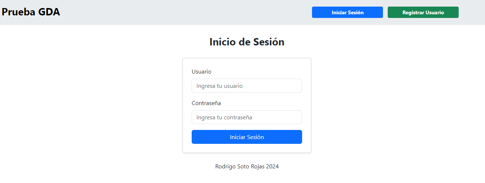
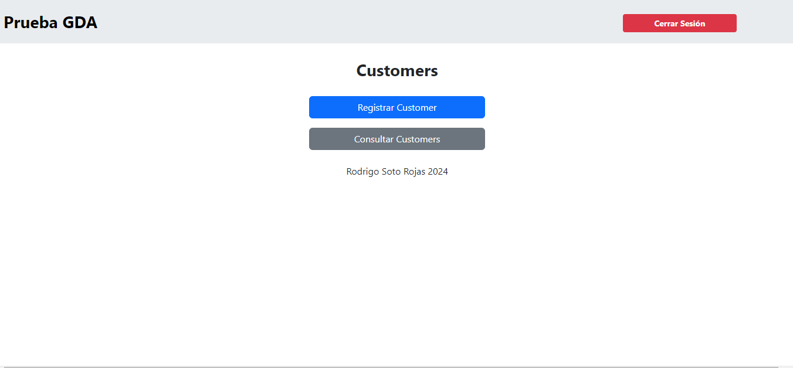
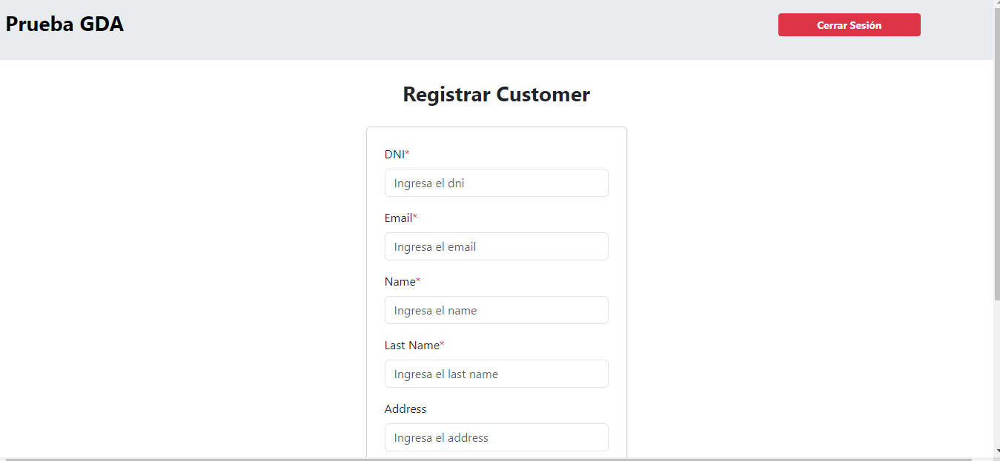
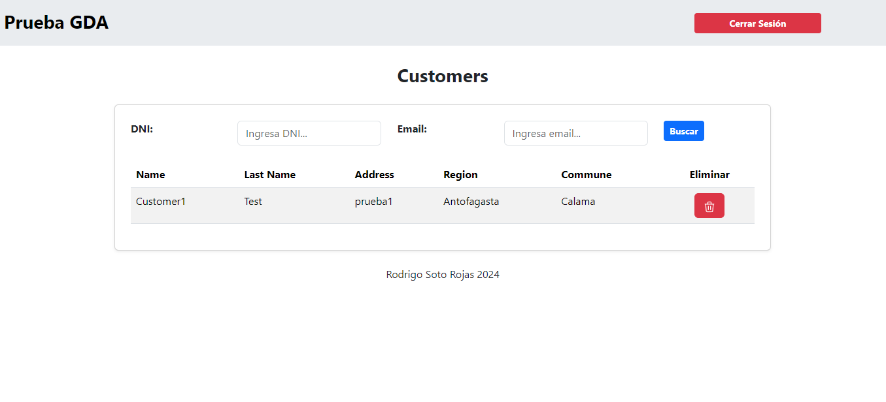

# Prueba GDA Rodrigo Soto Rojas

En este repositorio se encuentra una prueba técnica realizada con laravel

## Comenzando 🚀

_Primeramente para probar el proyecto se puede descargar directamente aquí o si tienes instalado git puedes hacer un git clone https://github.com/RodriiDev/prueba-gda-rodrigo.git._

## Instalación y Configuración 📋

**Que cosas necesitas instalar**

```
PHP 8
Laravel 9
Un gestor para MySql (Myql Workbench puede ser)
```

**Despues de tener esto instalado:**

Primero necesitamos tener nuestra base de datos, para eso en nuestro proyecto tenemos un archivo llamado **prueba-gda.sql**

Ese archivo lo abrimos con el MySQL Workbench o con cualquier gestor de MySQL y lo corremos

Para hacer nuestra conexión con nuestra base de datos configuramos nuestro archivo .env que viene en el proyecto de laravel
Un ejemplo de la configuración es la siguiente (lo que puede variar el username y password, ponemos los que tengamos en nuestro gestor)

```
DB_CONNECTION=mysql
DB_HOST=127.0.0.1
DB_PORT=3306
DB_DATABASE=mydb
DB_USERNAME=root
DB_PASSWORD=root
```

Ya que tengas laravel instalado y nuestra base de datos, abrimos una terminal y nos colocamos en la carpeta del proyecto y corremos el servidor con el siguiente comando:

```
php artisan serve
```

Y damos click en la url que nos dio para que se nos abra la aplicación en el navegador

## Definición de servicios

1. Registrar Customers

    Para registrar un customer primero es necesario registrar un usuario en el sistema y despues iniciar sesión, damos clic en el boton registrar usuario, ya que tengamos el usuario iniciamos sesión.

    

    Despues ya podemos registrar un customer, dando clic en registrar customer

    
    


2. Consulta de Customers

    Para entrar a consulta de customers simplemente damos clic en el boton respectivo una vez iniciada la sesión, y en la consulta podemos buscar por dni y email

    

3. Eliminar Customer

    Para eliminar un customer simplemente en la consulta damos en el boton rojo del bote de basura, y se borrará logicamente

